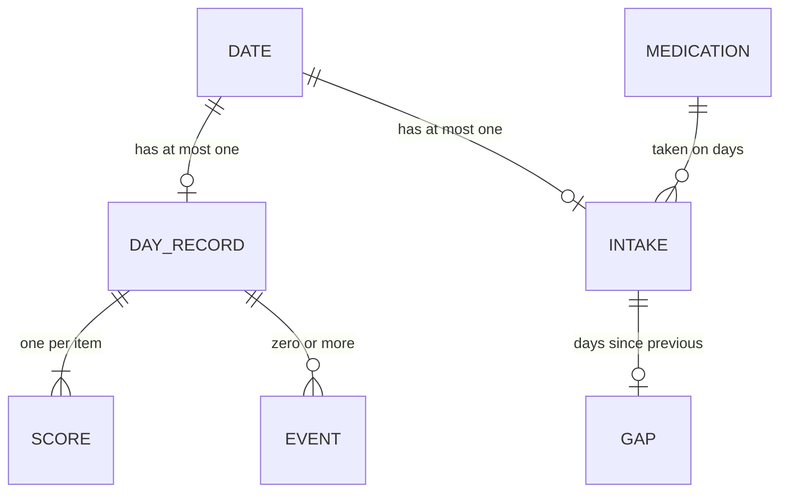

# Domain Spec: Moodcraft

*Drafted 2026-09-18 from an interview with the app's sole intended user. Status: draft.*

---

## 1. Purpose and scope

Moodcraft is a private, single-person tool for recording how you feel and what medication
you took, so that patterns between the two become visible. Its central question is narrower
than "does this medication work": it is **"how does the spacing between doses change how
well a dose works?"** — the user's stated belief being that doses taken too close together
are less effective, and that sensitivity recovers after a break.

The app is **descriptive**. It states what the recorded data shows. It never recommends a
dose, a gap, or a course of action, and it produces no clinical conclusion. The user
interprets; the app only makes the pattern visible.

It covers: the daily mood record, medication intake, life events that might explain a mood
change, and the charts and pattern statements derived from all three.

It does not cover: sharing, clinical use, treatment advice, or any interpretation the user
did not make themselves.

---

## 2. Actors

| Actor | Who they are | What they do here |
|---|---|---|
| **The user** | One person, tracking their own mood and medication | Records days, records intake, reads charts and pattern statements. The only actor. |

There is no second role. No clinician, no partner, no administrator, no support. Nobody
else ever sees the data unless the user exports a file and hands it over themselves.

---

## 3. Glossary

| Term | Meaning in this business | Notes / synonyms rejected |
|---|---|---|
| **Day record** | One day's worth of mood scores plus any events for that day | Not "entry" or "check-in" — it is always scoped to exactly one calendar day |
| **Item** | One of the 13 things scored 1–5 in a day record | Not "question", not "symptom" |
| **Score** | An item's value for one day, 1–5, where **5 is always the worst** | Not "rating" |
| **Medication** | Anything ingested that might move mood — prescribed drugs, supplements, caffeine, alcohol, nicotine | Deliberately broad. "Substance" was considered and rejected; the user calls it all medication |
| **Intake** | A day on which medication was taken, recorded as a total milligram amount | Not "dose event"; intake is per-day, never per-hour |
| **Dose** | The milligram amount of a single day's intake | |
| **Gap** | The number of days between one intake and the previous one | The central quantity of the whole app |
| **Break** | A deliberately long gap, taken to restore sensitivity | The user's word. A break is intentional, not forgetfulness |
| **Blunting** | The reduction in improvement observed when a dose follows too soon after the previous one | The user's phrase was "taken too closely they are less effective" |
| **Reset** | The point at which a gap is long enough that sensitivity has fully returned | |
| **Event** | A ticked life circumstance on a day record, marked good or bad | Exists to explain mood changes that medication did not cause |
| **Baseline** | The user's typical scores during the period before the medication was first taken | Measured only, never remembered or estimated |
| **Improvement** | Drop in scores on an intake day and the days following it, relative to baseline | Because 5 is worst, improvement is always a *decrease* |

---

## 4. Core concepts

### 4.1 Day record
What one day looked like. Identified by its **calendar date** — there is at most one day
record per date, ever. It holds a 1–5 score for each of the 13 items and zero or more
ticked events. It may be created on the day itself or entered later; the app does not
distinguish. Days with no record are **unknown**, not zero and not "fine".

A day record is explicitly **not** a diary. There is no narrative, no free text of record.

### 4.2 Item
One of the 13 things scored. Every item is worded so that **5 is the worst**, including
items that are naturally positive — "desire for company" is worded as *lack of desire for
company* rather than reverse-scored, so the user never mentally flips a scale.

The 13 items:

1. Tiredness
2. Rumination
3. Sadness
4. Loneliness
5. Social withdrawal — how much I avoided people
6. Lack of desire for company
7. Anhedonia — nothing felt enjoyable
8. Anxiety
9. Irritability
10. Difficulty concentrating
11. Lack of motivation
12. Hopelessness
13. Poor sleep

All 13 are scored on every day record. The list is **not frozen** — items may be added or
changed later, and the resulting holes in historic charts are accepted as the price of
being able to change it.

These items are inspired by established depression scales but are **not** a licensed
instrument, are not a validated screener, and produce no diagnostic total.

### 4.3 Medication
Something the user takes. Identified by its name. The app keeps a **library** of
medications the user has used, so a returning one can be picked rather than retyped.

A medication has **no configured properties at all** — no expected onset, no duration, no
target gap, no typical dose, no declared purpose. Everything the app knows about how a
medication behaves is inferred from the recorded data. This was an explicit decision.

Exactly **one medication is tracked and analysed at a time** (see R-11).

### 4.4 Intake
A record that on a given date, a given amount in milligrams was taken. Identified by
date — one intake record per medication per day, holding that **day's total**; two doses in
one day are entered as a single summed number.

Intake has day granularity only. Time of day is never recorded, and no analysis may depend
on hours-since-dose.

### 4.5 Event
A ticked circumstance on a day record, each carrying a good or bad sense. Events exist for
one purpose: so that a mood change with an obvious non-medication cause can be identified
as such, and so a pattern can be re-checked with those days set aside.

### 4.6 Gap
Not stored, but the most important derived thing in the domain: the number of days between
an intake and the one before it. Blunting, reset, breaks, and the whole spacing analysis
are expressed in gaps.

### 4.7 Dose bucket
Not stored, but derived for the duration-of-effect analysis: intakes grouped by mg amount
so their outcomes can be compared. Buckets are derived from the recorded mg values
themselves — never a configured threshold — so the app still holds no configured knowledge
about the medication (R-15).

---

## 5. Relationships

- A **day record** belongs to exactly one **date**, and a date has at most one day record.
- A day record holds exactly one **score** per **item** in the current item list.
- A day record holds **zero or more events**.
- An **intake** belongs to exactly one date and one **medication**. A date has at most one
  intake per medication.
- A date may have an intake with no day record, a day record with no intake, both, or
  neither. None of the four combinations is invalid — each means something different, and
  "intake with no day record" is simply an unmeasured dose.
- A **medication** has zero or more intakes across time. Only one medication is under
  analysis at a time; others remain in the library with their history intact.
- A **gap** relates two consecutive intakes of the same medication.

---

## 6. Lifecycles

**Day record** — has no states. It exists or it does not. It can be created for any date,
past or present, and edited freely afterwards with no trace of having been late or altered.
There is no locking, no submission, no finalisation.

**Medication** — has no formal states either, but moves through periods that matter to the
analysis:

- *Before first intake* — the period whose day records form the **baseline**.
- *In use* — intakes are occurring, separated by gaps.
- *On a break* — a deliberately extended gap, distinguishable from an ordinary gap only by
  length; the user does not mark a break as such.
- *Discontinued* — no further intakes. Not an explicit state; simply the absence of them.

The only transition that is irreversible in practice is the first intake: once it has
happened, the baseline period for that medication is closed and cannot be extended or
reconstructed.

---

## 7. Rules and invariants

**Recording**

- **R-01** *(hard)* — A day record covers exactly one calendar day. There is at most one per date.
- **R-02** *(hard)* — Every item is scored 1–5, and 5 always means worst, for every item without exception.
- **R-03** *(hard)* — All 13 items are answered on every day record.
- **R-04** *(hard)* — Intake is recorded as a single total milligram amount for the day. Time of day is never recorded.
- **R-05** *(hard)* — Day records may be created or edited for any past date without restriction, and carry no marking that they were entered late.

**Interpreting missing data**

- **R-06** *(hard)* — A date with no day record is **unknown**. It is never interpolated, never carried forward, and appears in charts as a visible gap.
- **R-07** *(hard)* — A date with no intake means the medication was **not taken**. Absence of intake is trusted as fact, not treated as possible forgetfulness.

**Analysis**

- **R-08** *(hard)* — The app states what the data shows and never recommends a dose, a gap, or an action.
- **R-09** *(hard)* — Effectiveness is measured against the **measured baseline** — the day records from before the medication's first intake. No baseline may be typed in from memory or substituted from a worst-scoring period.
- **R-10** *(hard)* — A medication with no measured pre-intake baseline receives **spacing analysis only** and never an effectiveness verdict.
- **R-11** *(hard)* — Exactly one medication is under analysis at a time. No attempt is made to attribute an effect across concurrent medications.
- **R-12** *(hard)* — Effect is looked for on the intake day **and the days following it**, never only same-day.
- **R-13** *(hard)* — Blunting is attributed to the **gap** since the previous intake and the **size** of that previous dose, with **events** treated as confounders to be accounted for.
- **R-14** *(hard)* — Recovery of sensitivity follows a **threshold** shape: below some number of days off, the effect is blunted; above it, sensitivity is fully reset. That threshold is **learned from the user's data**, never configured.
- **R-15** *(hard)* — The app holds no configured knowledge about any medication. Onset, duration, spacing and expected effects are all inferred.
- **R-16** *(soft)* — Every pattern statement is shown, however thin the data, but thin data is **visibly marked** — e.g. "based on 4 intakes".
- **R-17** *(hard)* — Analysis reports over **multiple time windows at once**: recent days weighted most heavily, alongside a long-term view of whether things are improving overall.
- **R-21** *(hard)* — Duration of effect is measured per **dose bucket** (§4.7), where buckets are derived from the recorded mg values, never a configured threshold. A day only counts toward a dose's decay curve if no later intake has occurred by that day, so no day is ever attributed to more than one dose. Per R-13, a day carrying a logged event still counts toward the curve — it is noted as confounded, never excluded.

**Data and privacy**

- **R-18** *(hard)* — Data lives on the device. No accounts, no cloud, no sync, no transmission.
- **R-19** *(hard)* — The user can export their data to a file they control, manually.
- **R-20** *(hard)* — The app never notifies, reminds, or nudges. It is opened when the user chooses to open it.

---

## 8. Processes

### 8.1 Recording a day
The user opens the app and records a day — usually today, sometimes a past date. They score
all 13 items and tick any events. If they took medication that day they enter the day's
total in milligrams. Nothing is triggered, nothing is submitted for approval, nothing
locks. The record simply exists and can be changed later.

Recording is **irregular by design** — roughly every few days, driven by medication use
rather than by a daily ritual. The app must work well with sparse, uneven data and must
never imply that a missed day is a failure.

### 8.2 Building the baseline
Before a medication's first intake, day records accumulate into its baseline. This happens
passively — the user does not declare a baseline period. Once the first intake is recorded,
the baseline is whatever was recorded before it, and that is final.

### 8.3 Finding the spacing pattern
For each intake, the app derives the gap since the previous one and the improvement in the
days that followed, relative to baseline. Across all intakes it looks for the relationship
between gap length, previous dose size, and improvement — setting aside or accounting for
days carrying events that could explain the mood independently.

The output is a statement of fact about the past, such as: *"Doses taken 1–3 days apart were
followed by 0.9 less improvement than doses 5 or more days apart."* It is never a
recommendation, and the reset threshold it reports is an observation about the recorded
data, not a rule the user is told to follow.

### 8.4 Reading the charts
Scores over time, with intakes and their doses overlaid, gaps visible as gaps, and events
marked. Both the recent-days view and the long-term view are available.

---

## 9. Edge cases and exceptions

- **Already taking something at install.** There is no "before" for it, so no effectiveness
  verdict is possible — only spacing analysis. The user chose this over any invented
  baseline (R-09, R-10).
- **Deliberate breaks.** A long gap is meaningful data, not missing data. The user takes
  breaks specifically to restore sensitivity, and the analysis depends on those breaks
  existing.
- **Intake on a day with no mood record.** Perfectly normal given irregular recording. The
  dose counts toward gap calculations; it simply has no measured outcome attached.
- **The item list changing.** Adding or rewording an item leaves earlier charts with a hole
  for that item. Accepted deliberately.
- **Very sparse data.** With recording every few days, many intakes will have thin or no
  follow-up. Patterns are still shown, marked as thin (R-16).
- **Events coinciding with doses.** The whole reason events exist. A good week that happens
  to contain a dose must be distinguishable from a dose that caused a good week.

---

## 10. Open questions

- **Q-01** — What exactly is on the event tick-list? A starting set was proposed (bad sleep,
  conflict, illness, work stress, good news, social event, exercise, travel) but never
  confirmed. It determines what the app can factor out, so it matters. *Ask the user.*
- **Q-02** — What is explicitly out of scope? Side effects, weight, physical symptoms,
  therapy sessions, menstrual cycle, a free-text journal, cost, and refill tracking were all
  offered for exclusion and the question went unanswered. Section 12 is currently an
  assumption. *Ask the user.*
- **Q-03** — Does "track only one medication" mean one forever, or one at a time with the
  ability to switch and keep the old one's history? Section 4.3 assumes the latter.
  *Ask the user.*
- **Q-04** — How does the app combine 13 items into "improvement"? A simple mean across all
  13, a weighted subset, or per-item tracking? The user said elsewhere that specific items
  may respond differently, which argues against a single number, but this was never settled.
- **Q-05** — Does a dose taken during a medication's baseline period ever happen — i.e. can
  the user have taken it before they started recording? If so, the baseline is contaminated
  and R-09 needs a caveat.

---

## 11. Assumptions

Asserted in this document but **not confirmed** by the user:

- **A-01** — Assumed the medication library persists, so a previously used medication can be
  re-selected with its history intact. Derived from an earlier answer that predates the
  single-medication decision.
- **A-02** — Assumed events are recorded on the day record, not attached to intakes.
- **A-03** — Assumed the event tick-list is fixed and app-defined rather than user-editable.
- **A-04** — Assumed there is no free-text note on a day record. The user was offered one
  alongside the tick-list and did not take it up.
- **A-05** — Assumed export is a plain data file (JSON or CSV) for the user's own keeping,
  with no printable doctor-facing summary. The latter was offered and not chosen.
- **A-06** — Assumed "a break" is identified purely by gap length and is never marked as
  intentional by the user.
- **A-07** — Assumed there is no concept of a medication being "supposed to be" taken daily,
  so the app never reports a missed dose. Follows from R-15; the user called this question
  irrelevant once single-medication tracking was decided.
- **A-08** — Assumed the specific 13 items listed in 4.2 are final. The user said "add all
  you recommend" to a proposed list rather than authoring it themselves.

---

## 12. Out of scope

*Provisional — see Q-02.*

- Any second user, sharing, or clinician access
- Accounts, cloud storage, sync, or any network transmission of data
- Dose or spacing recommendations, and any advice framed as what the user should do
- Diagnosis, screening, scoring against clinical cut-offs, or crisis detection
- Concurrent multi-medication attribution
- Hour-level intake timing and same-day time-course analysis
- Reminders and notifications
- Side effects, weight, physical symptoms, menstrual cycle, therapy sessions
- A free-text diary or journal
- Medication cost, supply, and refill tracking
